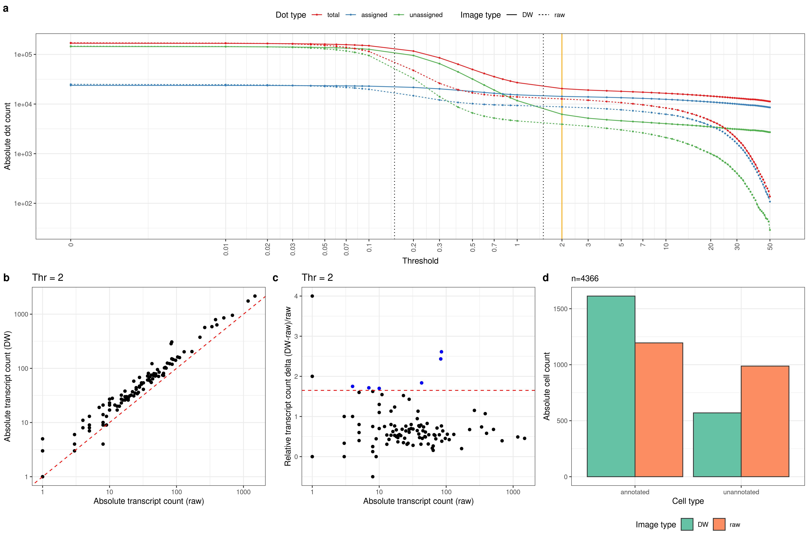
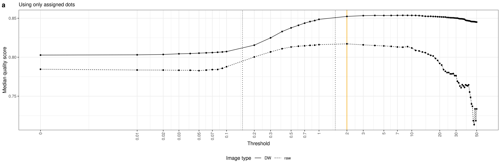

# Deconwolf on *in situ* transcriptomic data

Draft text: [here](https://docs.google.com/document/d/1FSr8qI8tQaduHLGC90o6I0BiqRBBGtMpNCI8gJZRguQ/edit)

## Figures

### Figure 4

- [x] Panel a: counts of assigned/unassigned/total dots per threshold.
- [x] Panel b: transcript counts of DW vs Raw.
- [x] Panel c: relative difference in transcripts count to identify most affected targets.
- [x] Panel d: number of un/annotated cells.

### Supplementary Figure X4

- [x] Panel a: median quality score of assigned dots.
- [x] Panel b: image with signal for FTH1 target.
- [x] Panel c: image with signal for SPARCL1 target.
- [x] Panel d: image with signal for ENC1 target.
