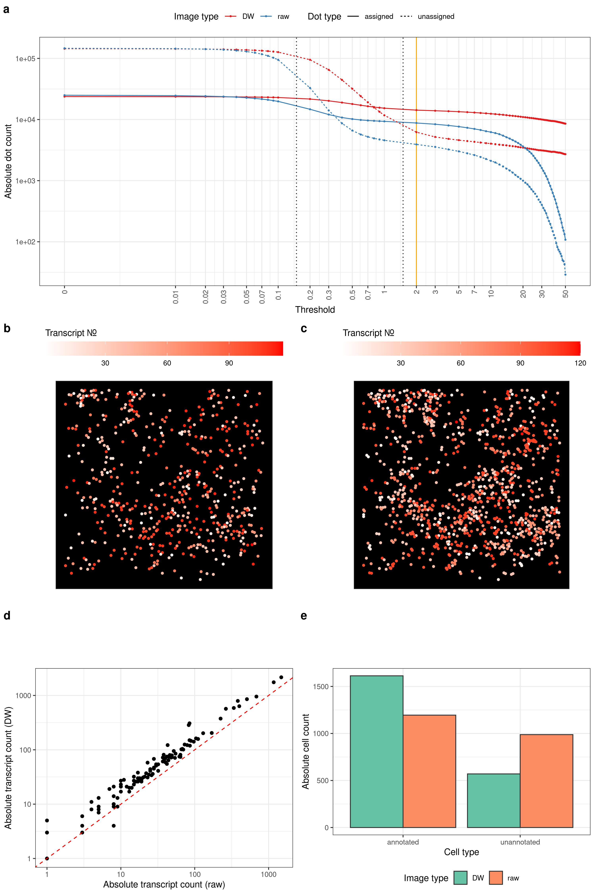
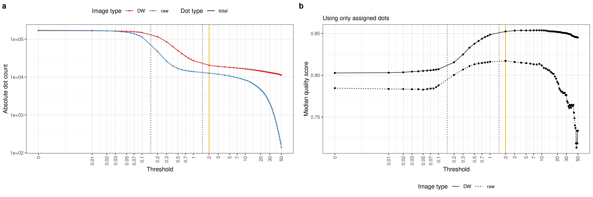

# Deconwolf on *in situ* transcriptomic data

Draft text: [here](https://docs.google.com/document/d/1FSr8qI8tQaduHLGC90o6I0BiqRBBGtMpNCI8gJZRguQ/edit)

## Figures

### Figure 4

- [x] Panel a: counts of assigned/unassigned dots per threshold.
- [x] Panel b: visualization of transcript spots in a field of view, RAW.
- [x] Panel c: visualization of transcript spots in a field of view, DW.
- [x] Panel d: transcript counts of DW vs Raw.
- [x] Panel e: number of un/annotated cells.

### Supplementary Figure X4

- [x] Panel a: counts of total dots per threshold.
- [x] Panel b: median quality score of assigned dots.
